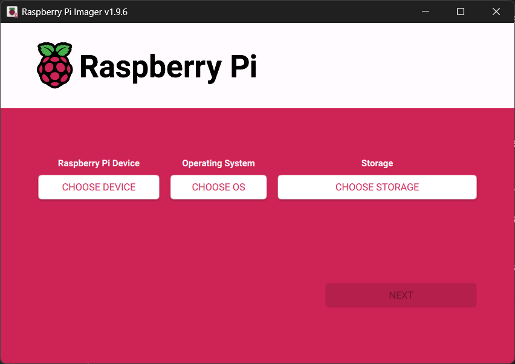
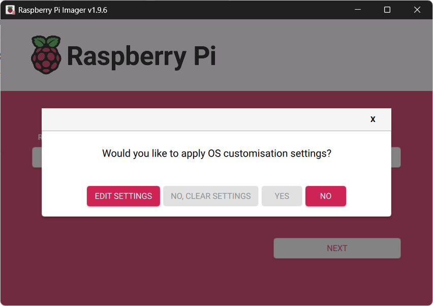
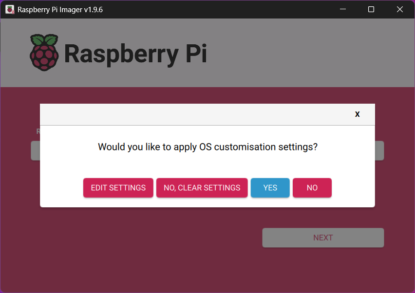
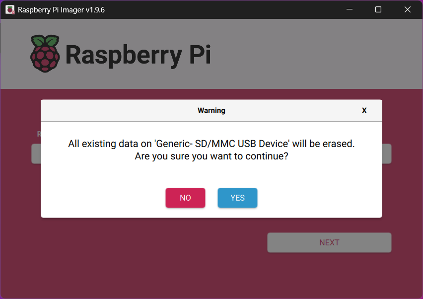
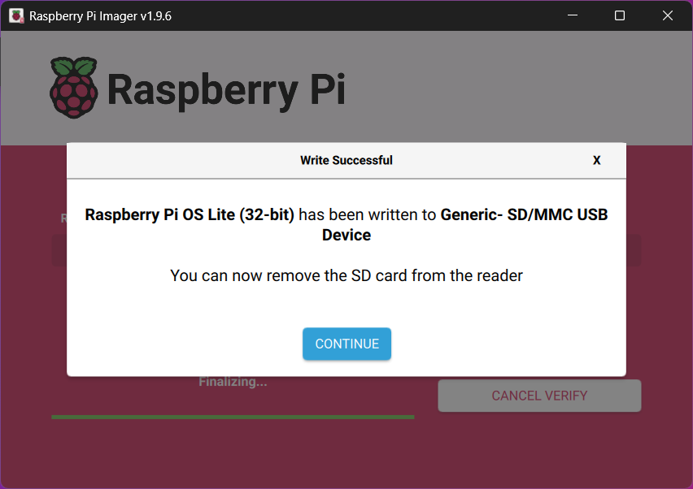

# How to get your Raspberry Pi up and running

## Requirements

- A Raspberry Pi
- An SD card
- Internet access
- A PC (Windows, Mac, or Linux) with an SD card reader and an SSH client

## What do I have?

This is what I used, so your specific steps might look slightly different:
- [Raspberry Pi 2 Model B Rev 1.1](https://www.raspberrypi.org/products/raspberry-pi-2-model-b/)
- [TP-Link USB WiFi Adapter TL-WN725N](https://www.tp-link.com/us/home-networking/usb-adapter/tl-wn725n/)(*)
- [Windows 11](https://www.microsoft.com/en-us/software-download/windows11)

(*) The USB WiFi adapter isn't essential. You can just plug the Raspberry into your router with an Ethernet cable.

## Steps

1. [Write the Raspberry Pi OS to the SD card](#sd)
2. [First boot](#startup)
3. [Update and configure](#update)
4. [Backup](#backup)

## <a name="sd"></a>Write the Raspberry Pi OS to the SD card

*(From your PC)*

Download [Raspberry Pi Imager](https://www.raspberrypi.org/software/).

Install it and launch it.



Click '*CHOOSE DEVICE*' and select '*Raspberry Pi 2 - Model B*'.

Click '*CHOOSE OS*' and select '*Raspberry Pi OS (other)* / *Raspberry Pi OS Lite (32-bit)*'.

Clock '*CHOOSE STORAGE*' and select your SD card.

Click '*NEXT*'.



Click '*EDIT SETTING*'

In the 'OS Customisation' window, set these things up:

### General

Set hostname = fin392pi.local

Set username and password
- Username = fin392
- Password = abc123

Configure wireless LAN
- SSID = WLAN_1234
- Passowrd = ABCD1234ABCD
- Hidden SSID = OFF
- Wireless LAN country = ES

Set locale settings
- Time zone = Europe/Madrid
- Keyboard layout = es

### Services

Enable SSH = Use password authentication

### Options

Play sound when finished = OFF

Eject media when finished = ON

Enable telemetry = OFF



Click '*YES*'



Click '*YES*'



Click '*CONTINUE*'

## <a name="startup"></a>First boot

*(From your Raspberry Pi)*

Plug a monitor into the HDMI port, insert the SD card, and power it on.

Give it a few minutes (it might restart a couple of times). You should see something like this:

```
Raspbian GNU/Linux 12 FIN392PI tty1
My IP address in 192.168.1.20 fe80:ef73:d389:f130:5526
FIN392PI login: _
```

Note the IP address.

You can now disconnect the HDMI cable. From here on out, we'll be using SSH to access it.

*(From your PC)*

Open your Command Prompt and run the SSH client like this:

```
C:\> ssh.exe fin392@192.168.1.20
```

If you see this warning...

``` 
@@@@@@@@@@@@@@@@@@@@@@@@@@@@@@@@@@@@@@@@@@@@@@@@@@@@@@@@@@@
@    WARNING: REMOTE HOST IDENTIFICATION HAS CHANGED!     @
@@@@@@@@@@@@@@@@@@@@@@@@@@@@@@@@@@@@@@@@@@@@@@@@@@@@@@@@@@@
IT IS POSSIBLE THAT SOMEONE IS DOING SOMETHING NASTY!
Someone could be eavesdropping on you right now (man-in-the-middle attack)!
It is also possible that a host key has just been changed.
The fingerprint for the ED25159 key sent by the remote host is
SHA256:MFKJ/n8PpDzevg3hmTvr+NFAjE32xn7K4LFW8zXPMTC.
Please contact your system administrator.
Add correct host key in C:\\Users\\fin392/.ssh/known_hosts to get rid of this message.
Offending ECDSA key in C:\\Users\\fin392/.ssh/known_hosts:3
Host key for 192.168.1.20 has changed and you have requested strict checking.
Host key verification failed.
```

...you just need to delete this file:

```
C:\> del  C:\Users\fin392\.ssh\known_hosts
```

If the following message is displayed...

```
The authenticity of host '192.168.1.20 (192.168.1.20)' can't be established.
ED25159 key fingerprint is SHA256:MFKJ/n8PpDzevg3hmTvr+NFAjE32xn7K4LFW8zXPMTC.
This key is not known by any other names.
Are you sure you want to continue connecting (yes/no/[fingerprint])?
```

...type '*yes*'.

If everything has gone well, you will be asked for the password of the user '*fin392*':

```fin392@192.168.1.20's password:```

After type the password, if this message is displayed...

```
Linux FIN392PI 6.12.25+rpt-rpi-v7 #1 SMP Raspbian 1:6.12.25-1+rpt1 (2025-04-30) armv7l

The programs included with the Debian GNU/Linux system are free software;
the exact distribution terms for each program are described in the
individual files in /usr/share/doc/*/copyright.

Debian GNU/Linux comes with ABSOLUTELY NO WARRANTY, to the extent
permitted by applicable law.
fin392@FIN392PI:~ $
```

...congrats, you're now logged into your Raspberry Pi!

## <a name="update"></a>Update and configure

Next, we need to config a few settings. It's easier to just run all these commands as 'root':

```
sudo -i
```

### 1. Make *sudo* always ask for the password

Edit the sudoers file:

```
visudo
```

Change line ```Defaults        env_reset``` to ```Defaults        env_reset, timestamp_timeout=0```.

Remove file '010_pi-nopasswd'

```
rm /etc/sudoers.d/010_pi-nopasswd
```

### 2. Switch from Dynamic (DHCP) to a Static IP

```
nmcli con mod "preconfigured" ipv4.addresses 192.168.1.20/24
nmcli con mod "preconfigured" ipv4.gateway 192.168.1.1
nmcli con mod "preconfigured" ipv4.dns "1.1.1.1 8.8.8.8"
nmcli con mod "preconfigured" ipv4.method manual
```

```
nmcli con down "preconfigured" && nmcli con up "preconfigured"
```

You'll need to reconnect after this step, making sure to use the new static IP address:

```
C:\> ssh.exe fin392@192.168.1.20
```

### 3. Update the OS

Run these update commands first...

```
sudo -i
apt update -y
apt upgrade -y
apt autoremove -y
```
...and then reboot:

```
reboot
```

## <a name="backup"></a>Backup

It is highly recommended to create a backup of your SD card.

'*Win32 Disk Imager*' is a solid tool for this. You can grab it from their official website [win32diskimager.org](https://win32diskimager.org/).

---
